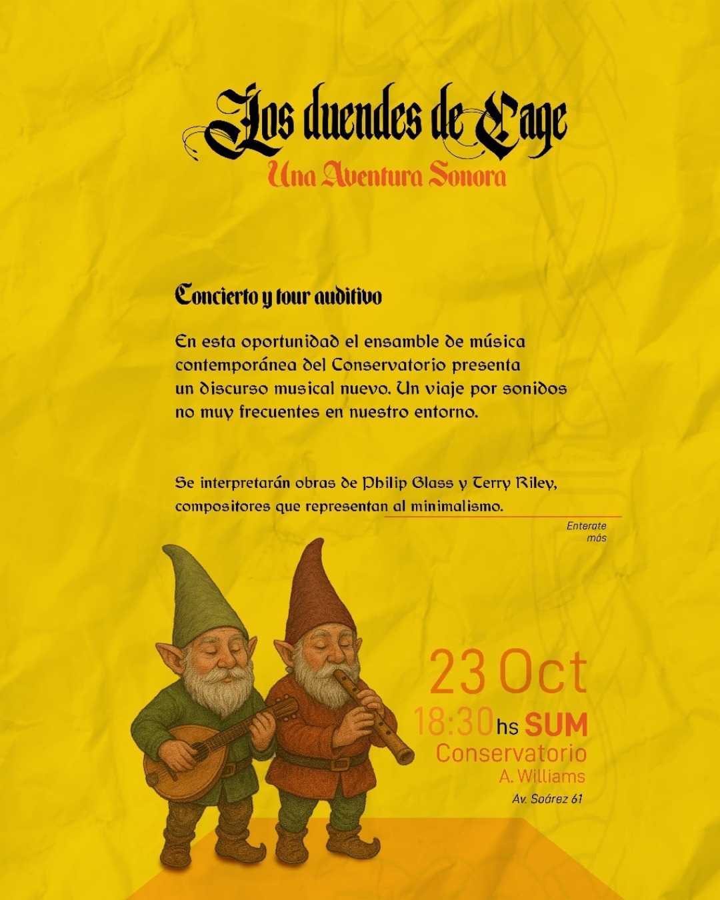

# Alumnes del [Conservatorio Alberto Williams](www.instagram.com/conser_chivilcoy/) interpretan a Philip Glass y Terry Riley a cargo del profesor Pablo Torre

---

# Philip Glass



[Streaming en formato WAV](https://pixeldrain.com/u/tsqQTsky)

---

# Terry Riley



[Streaming en formato WAV](https://pixeldrain.com/u/TTZ5xGkN)

