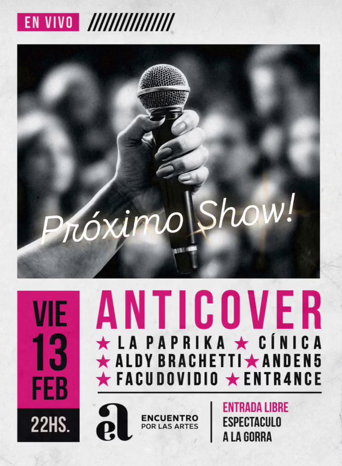

# 

# Anticover número 13. Bueno, no llegué a grabar a Anden 5 y el audio de Entrance se perdió D: gracias a Ro y a Nico por organizar el anticover en chivil, y a Encuentro por el espacio.

---

# [Cínica](https://www.instagram.com/_cinicabanda/) (solo calle roja)



[Streaming en formato WAV](https://pixeldrain.com/u/GQnETMxp)

---

# [Facu Dovidio](https://www.instagram.com/fadovidio/)



[Streaming en formato WAV](https://pixeldrain.com/u/YjaGms7g)

---

# [Paprika's Band](https://www.instagram.com/lapaprikaband/)



[Streaming en formato WAV](https://pixeldrain.com/u/k6FLgYhB)

---

# Poemas de [Daniel Casas](https://www.instagram.com/danqxcasas/) y [Memi Mesplet](https://www.instagram.com/memimesplet/)





