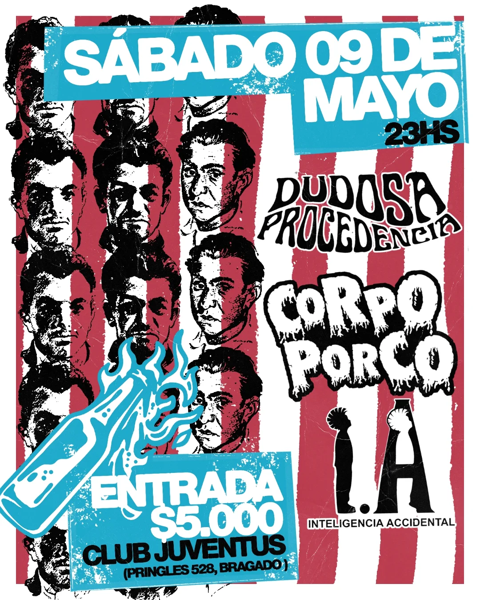
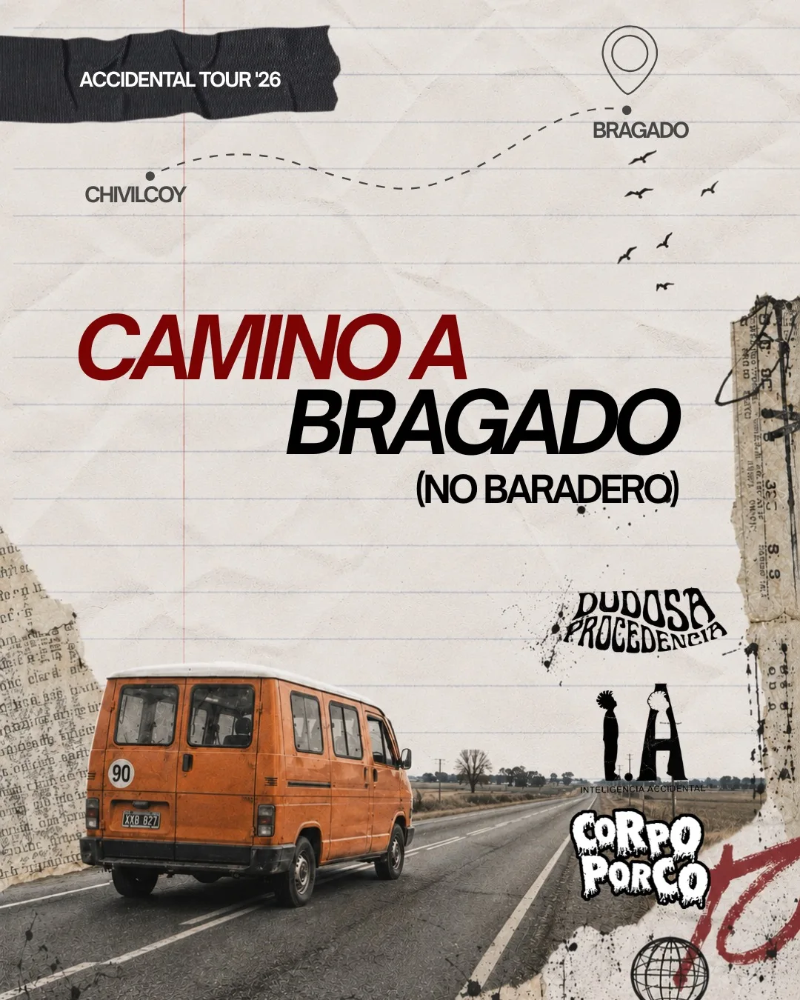
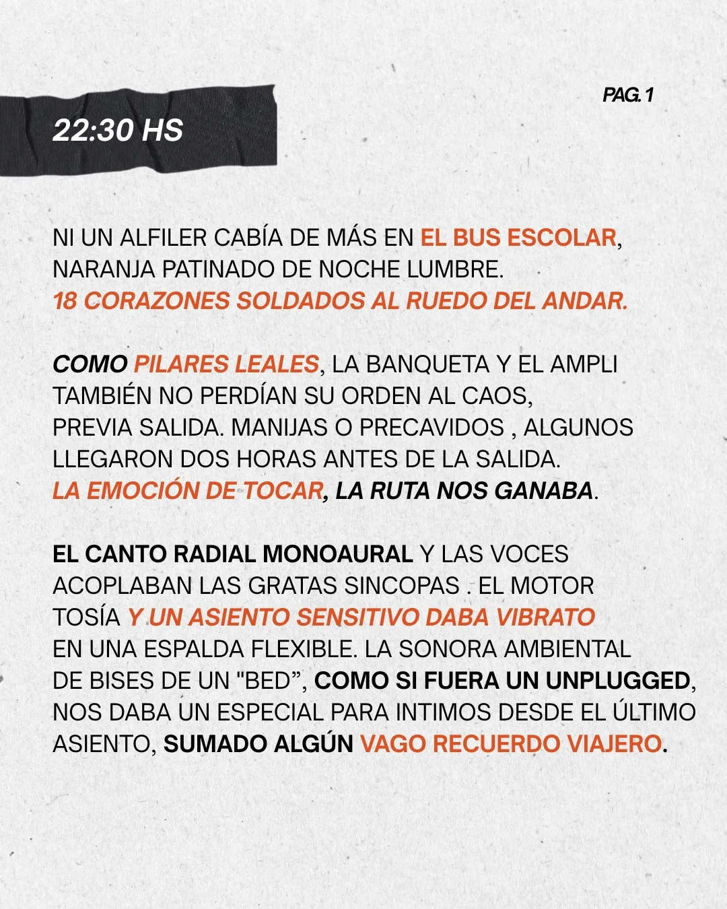
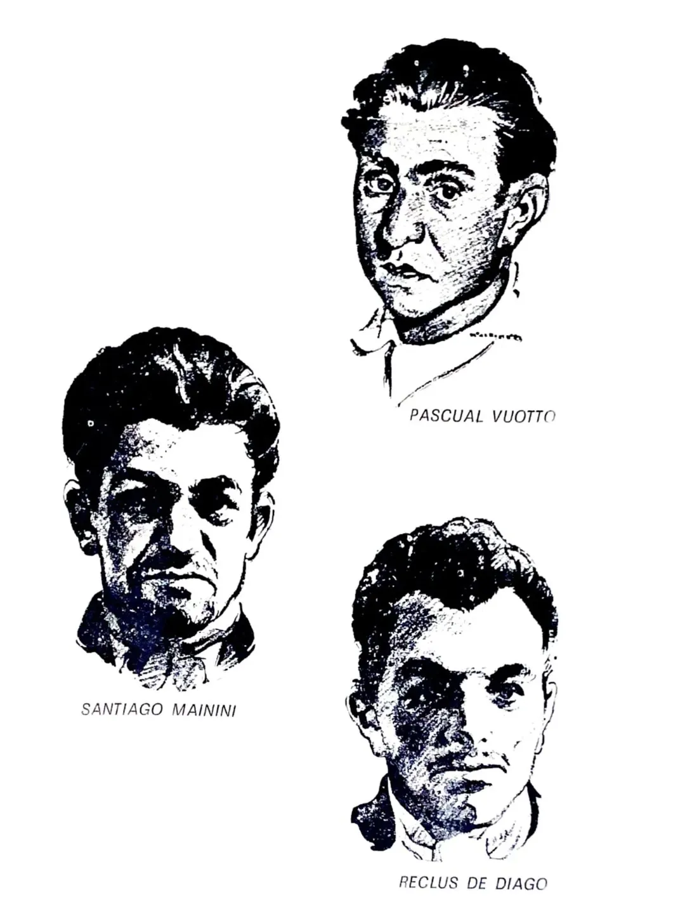
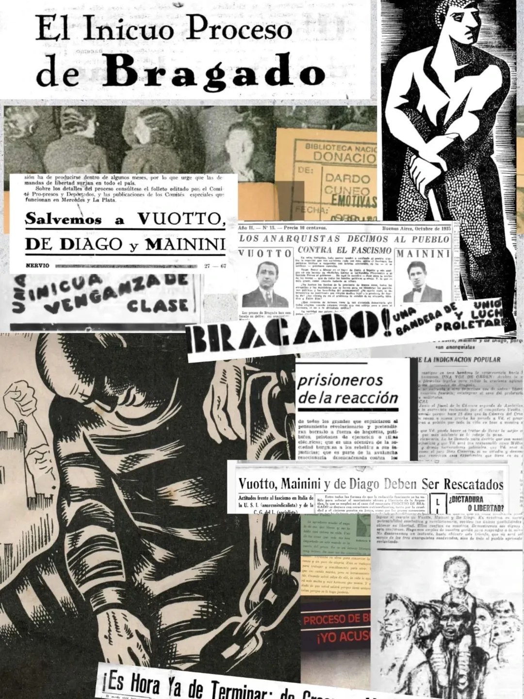
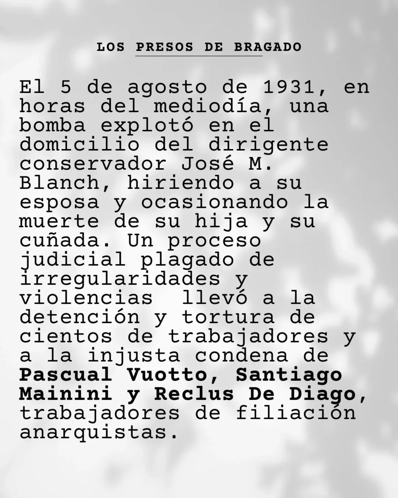
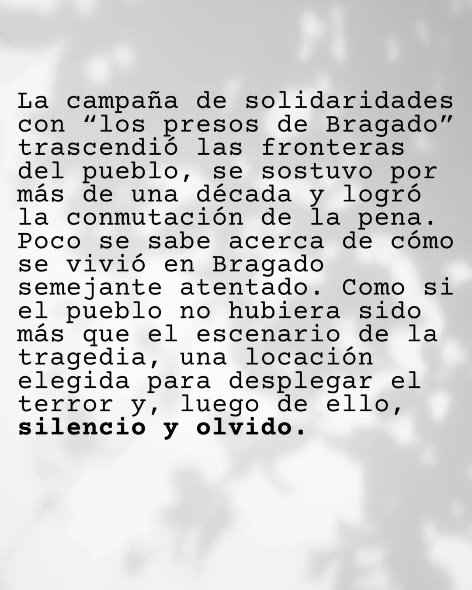

 
### *Los rostros que están en este flyer hecho por @max_setentista, son los de Reclus De Diago, Santiago Mainini y Pascual Vuotto, anarquistas encarcelados injustamente en 1931 en el denominado "proceso de Bragado".
  
 

# Gracias Mcain  por la invitación, fue una experiencia religiosa. Gracias a [Archivos Incomodos](https://www.instagram.com/club.alternativo/) por mantener la memoria presente y a [Club Alternativo](https://www.instagram.com/club.alternativo/) por los versos y el fanzine.

---
# [Dudosa Procedencia](https://www.instagram.com/dudosaprocedencia_/)



[Streaming en formato WAV](https://pixeldrain.com/u/8tB6TXPS)

---
# [Inteligencia Accidental](https://www.instagram.com/inteligencia.accidental/)



[Streaming en formato WAV](https://pixeldrain.com/u/Xsu3EcKQ)

---
# [Corpo Porco](https://www.instagram.com/corpoporco/)



[Streaming en formato WAV](https://pixeldrain.com/u/vgBG9ZLb)

---

# LOS PRESOS DE BRAGADO

   

# Archivos incómodos para otras memorias posibles ✊🏽⚒️

# “Si el archivo es la ley y su institución, la noción de “desarchivar” también puede referir a la desobediencia ante lo que se puede recordar y, por lo tanto, ante lo que se puede decir (Aillon, Virginia).